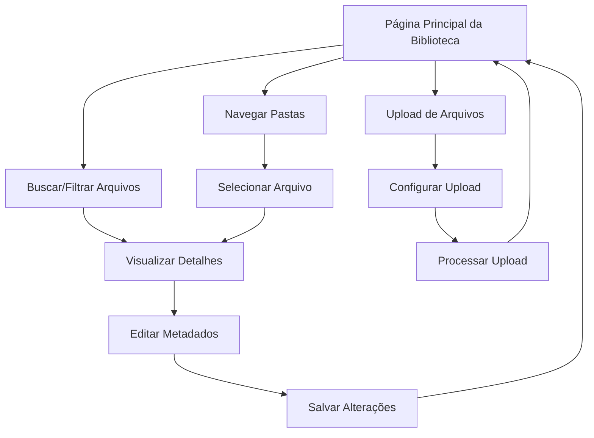

# Documento de Requisitos do Produto - Media Library (Biblioteca de Mídia)

## 1. Visão Geral do Produto

A Media Library é um sistema abrangente de gerenciamento de arquivos que permite aos usuários fazer upload, organizar, pesquisar e compartilhar diversos tipos de mídia dentro da plataforma colaborativa. O sistema oferece uma interface intuitiva para gerenciar arquivos digitais com recursos avançados de organização e integração com editores de texto.

- **Objetivo Principal**: Centralizar e facilitar o gerenciamento de todos os arquivos de mídia utilizados nos projetos colaborativos, proporcionando acesso rápido e organizado aos recursos digitais.
- **Valor de Mercado**: Aumenta a produtividade das equipes ao eliminar a necessidade de gerenciar arquivos em múltiplas plataformas, oferecendo uma solução integrada e eficiente.

## 2. Funcionalidades Principais

### 2.1 Papéis de Usuário

| Papel | Método de Registro | Permissões Principais |
|-------|-------------------|----------------------|
| Usuário Básico | Registro por email | Upload de arquivos, visualização, organização pessoal |
| Usuário Avançado | Upgrade por convite | Compartilhamento, criação de pastas públicas, gestão de tags |
| Administrador | Acesso administrativo | Gestão de quotas, moderação de conteúdo, configurações globais |

### 2.2 Módulo de Funcionalidades

Nossa biblioteca de mídia consiste nas seguintes páginas principais:

1. **Página Principal da Biblioteca**: navegação por pastas, visualização em grade/lista, barra de pesquisa, filtros avançados.
2. **Página de Upload**: área de drag & drop, seleção múltipla de arquivos, barra de progresso, configurações de upload.
3. **Página de Detalhes do Arquivo**: preview do arquivo, metadados, histórico de versões, opções de compartilhamento.
4. **Página de Gerenciamento**: organização de pastas, gestão de tags, configurações de permissões, relatórios de uso.

### 2.3 Detalhes das Páginas

| Nome da Página | Nome do Módulo | Descrição da Funcionalidade |
|----------------|----------------|------------------------------|
| Página Principal | Navegador de Arquivos | Exibir arquivos em grade/lista, navegação por pastas, busca instantânea, filtros por tipo/data/tags |
| Página Principal | Barra de Ferramentas | Botões de upload, criar pasta, visualização, ordenação, seleção múltipla, ações em lote |
| Página de Upload | Área de Upload | Drag & drop de arquivos, seleção múltipla, validação de tipos, barra de progresso em tempo real |
| Página de Upload | Configurações | Definir pasta de destino, adicionar tags, configurar permissões, metadados automáticos |
| Página de Detalhes | Preview de Arquivo | Visualização de imagens/vídeos/documentos, zoom, rotação, reprodução de mídia |
| Página de Detalhes | Painel de Metadados | Informações do arquivo, tags editáveis, histórico de modificações, estatísticas de uso |
| Página de Detalhes | Controles de Versão | Lista de versões, comparação, restauração, download de versões específicas |
| Página de Gerenciamento | Organizador de Pastas | Criar/editar/mover pastas, estrutura hierárquica, permissões por pasta |
| Página de Gerenciamento | Sistema de Tags | Criar/editar tags, categorização automática, tags sugeridas, filtros por tags |
| Página de Gerenciamento | Configurações de Quota | Monitoramento de uso de espaço, limites por usuário, alertas de quota, relatórios |

## 3. Processo Principal

### Fluxo do Usuário Regular

O usuário acessa a biblioteca de mídia, navega pelas pastas ou utiliza a busca para encontrar arquivos. Pode fazer upload de novos arquivos através de drag & drop, organizar conteúdo em pastas e aplicar tags. Durante a edição de documentos, pode inserir arquivos diretamente da biblioteca.

### Fluxo do Administrador

O administrador monitora o uso de espaço, gerencia quotas de usuários, modera conteúdo inadequado e configura permissões globais. Tem acesso a relatórios detalhados de uso e pode realizar operações em lote para manutenção do sistema.

## 4. Design da Interface do Usuário

### 4.1 Estilo de Design

- **Cores Primárias**: #3B82F6 (azul principal), #1E40AF (azul escuro)
- **Cores Secundárias**: #F3F4F6 (cinza claro), #6B7280 (cinza médio)
- **Estilo de Botões**: Arredondados com sombra sutil, efeitos hover suaves
- **Fontes**: Inter (títulos 18-24px), System UI (corpo 14-16px)
- **Layout**: Grid responsivo com cards para arquivos, sidebar para navegação
- **Ícones**: Lucide React com estilo minimalista, ícones específicos por tipo de arquivo

### 4.2 Visão Geral do Design das Páginas

| Nome da Página | Nome do Módulo | Elementos da UI |
|----------------|----------------|-----------------|
| Página Principal | Navegador de Arquivos | Grid responsivo de cards, thumbnails automáticos, overlay com ações, breadcrumb de navegação |
| Página Principal | Barra de Ferramentas | Botões com ícones, dropdown de filtros, toggle de visualização, barra de busca com autocomplete |
| Página de Upload | Área de Upload | Zona de drag & drop estilizada, lista de arquivos com progresso, preview de thumbnails |
| Página de Detalhes | Preview Central | Viewer responsivo, controles de zoom/rotação, player de mídia integrado |
| Página de Gerenciamento | Painel de Controle | Layout em abas, formulários organizados, tabelas de dados, gráficos de uso |

### 4.3 Responsividade

O produto é mobile-first com adaptação para desktop. Inclui otimizações para interação touch, gestos de swipe para navegação e interface simplificada em telas menores. O upload por drag & drop é substituído por seleção de arquivos em dispositivos móveis.