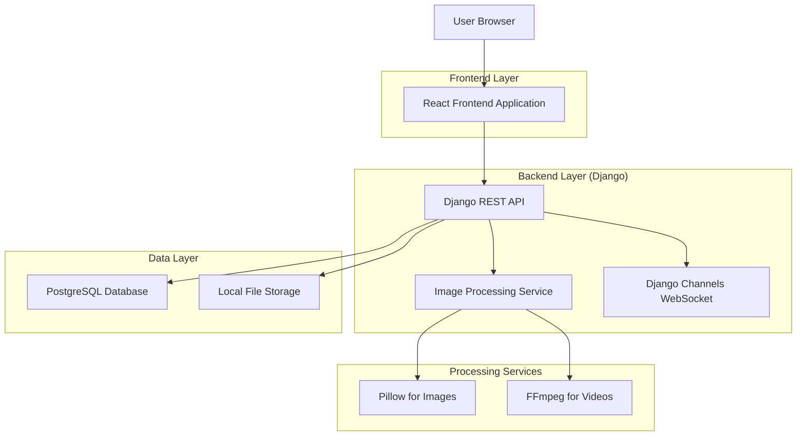
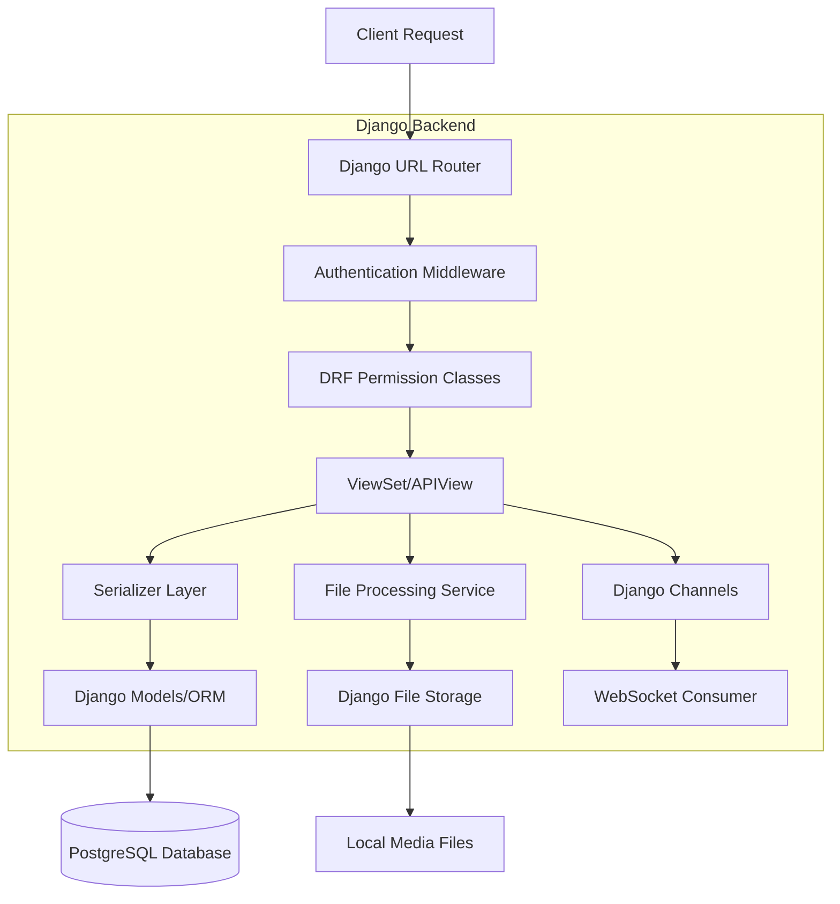
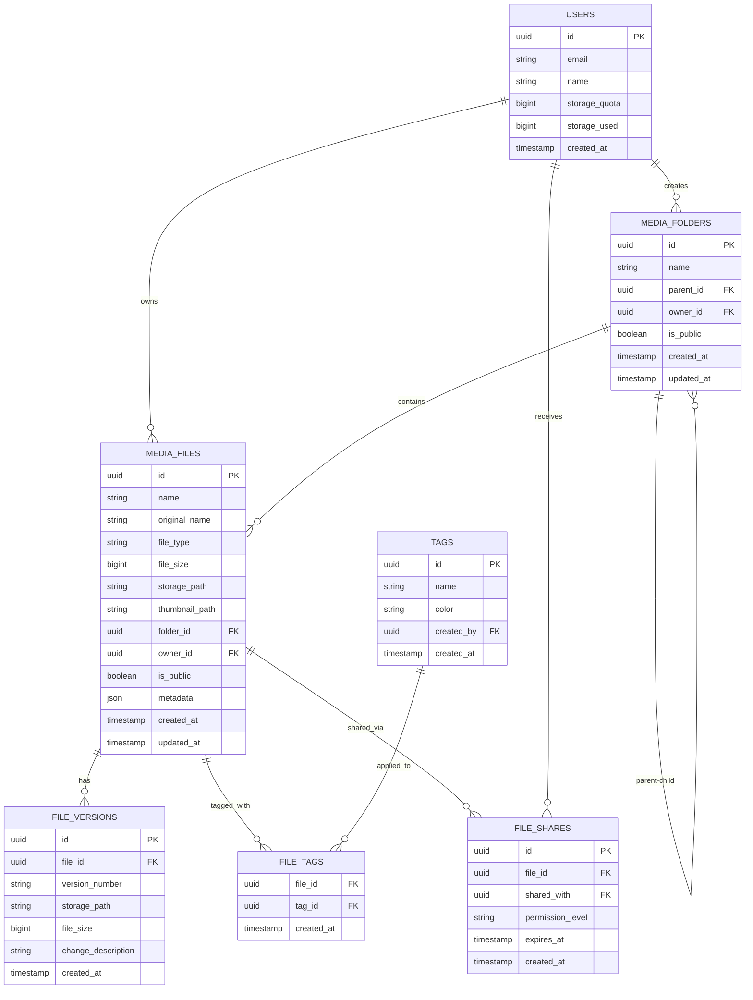

# Documento de Arquitetura Técnica - Media Library (Biblioteca de Mídia)

## 1. Design da Arquitetura



## 2. Descrição das Tecnologias

- **Frontend**: React@18 + TypeScript + TailwindCSS@3 + Vite + React Query + React Hook Form
- **Backend**: Django@4.2 + Django REST Framework + Django Channels
- **Database**: PostgreSQL (local) + Redis para cache e WebSocket
- **Storage**: Sistema de arquivos local com Django FileField/ImageField
- **Processamento**: Pillow para imagens, FFmpeg para vídeos

## 3. Definições de Rotas

| Rota | Propósito |
|------|-----------|
| /media | Página principal da biblioteca de mídia |
| /media/upload | Página de upload de arquivos |
| /media/folder/:id | Visualização de pasta específica |
| /media/file/:id | Página de detalhes do arquivo |
| /media/search | Página de resultados de busca |
| /media/manage | Página de gerenciamento e configurações |
| /media/shared | Arquivos compartilhados comigo |

## 4. Definições de API

### 4.1 API Principal (Django REST Framework)

**Upload de arquivos**
```
POST /api/media/upload/
```

Request (multipart/form-data):
| Nome do Parâmetro | Tipo | Obrigatório | Descrição |
|-------------------|------|-------------|-----------|
| files | File[] | true | Array de arquivos para upload |
| folderId | string | false | ID da pasta de destino |
| tags | string[] | false | Tags para categorização |
| isPublic | boolean | false | Define se o arquivo é público |

Response:
| Nome do Parâmetro | Tipo | Descrição |
|-------------------|------|-----------|
| success | boolean | Status da operação |
| files | MediaFile[] | Informações dos arquivos enviados |
| errors | string[] | Lista de erros, se houver |

**Buscar arquivos**
```
GET /api/media/search/
```

Request:
| Nome do Parâmetro | Tipo | Obrigatório | Descrição |
|-------------------|------|-------------|-----------|
| query | string | false | Termo de busca |
| type | string | false | Filtro por tipo de arquivo |
| folder_id | string | false | Buscar em pasta específica |
| tags | string[] | false | Filtrar por tags |
| limit | number | false | Limite de resultados (padrão: 20) |
| offset | number | false | Offset para paginação |

Response:
| Nome do Parâmetro | Tipo | Descrição |
|-------------------|------|-----------|
| results | MediaFile[] | Lista de arquivos encontrados |
| count | number | Total de arquivos encontrados |
| next | string | URL da próxima página |
| previous | string | URL da página anterior |

**Gerenciar pastas**
```
POST /api/media/folders/
PUT /api/media/folders/{id}/
DELETE /api/media/folders/{id}/
GET /api/media/folders/
GET /api/media/folders/{id}/
```

**Controle de versões**
```
POST /api/media/files/{id}/versions/
GET /api/media/files/{id}/versions/
```

**Compartilhamento**
```
POST /api/media/files/{id}/share/
PUT /api/media/files/{id}/permissions/
```

### 4.2 WebSocket Events (Django Channels)

```python
# Eventos do cliente para servidor (Django Channels)
class MediaConsumer(AsyncWebsocketConsumer):
    async def upload_progress(self, event):
        # Progresso de upload
        pass
    
    async def file_subscribe(self, event):
        # Inscrever-se em atualizações de arquivo
        pass
    
    async def folder_subscribe(self, event):
        # Inscrever-se em atualizações de pasta
        pass

# Eventos enviados do servidor para cliente
{
    'type': 'upload_complete',
    'file': MediaFile,
}
{
    'type': 'upload_error', 
    'file_id': str,
    'error': str,
}
{
    'type': 'file_updated',
    'file': MediaFile,
}
{
    'type': 'file_deleted',
    'file_id': str,
}
{
    'type': 'folder_updated',
    'folder': MediaFolder,
}
```

## 5. Arquitetura do Servidor (Django)



## 6. Modelo de Dados

### 6.1 Definição do Modelo de Dados



### 6.2 Django Models (models.py)

**Modelo de Usuário (User)**
```python
# Usar o modelo User existente do Django
# Adicionar campos para quota de armazenamento via Profile ou extensão
from django.contrib.auth.models import User
from django.db import models

class UserProfile(models.Model):
    user = models.OneToOneField(User, on_delete=models.CASCADE)
    storage_quota = models.BigIntegerField(default=1073741824)  # 1GB
    storage_used = models.BigIntegerField(default=0)
    created_at = models.DateTimeField(auto_now_add=True)
    updated_at = models.DateTimeField(auto_now=True)
```

**Modelo de Pastas de Mídia (MediaFolder)**
```python
class MediaFolder(models.Model):
    id = models.UUIDField(primary_key=True, default=uuid.uuid4, editable=False)
    name = models.CharField(max_length=255)
    parent = models.ForeignKey('self', on_delete=models.CASCADE, null=True, blank=True)
    owner = models.ForeignKey(User, on_delete=models.CASCADE)
    is_public = models.BooleanField(default=False)
    created_at = models.DateTimeField(auto_now_add=True)
    updated_at = models.DateTimeField(auto_now=True)

    class Meta:
        indexes = [
            models.Index(fields=['owner']),
            models.Index(fields=['parent']),
        ]
```

**Modelo de Arquivos de Mídia (MediaFile)**
```python
class MediaFile(models.Model):
    id = models.UUIDField(primary_key=True, default=uuid.uuid4, editable=False)
    name = models.CharField(max_length=255)
    original_name = models.CharField(max_length=255)
    file_type = models.CharField(max_length=100)
    file_size = models.BigIntegerField()
    file = models.FileField(upload_to='media_files/%Y/%m/%d/')
    thumbnail = models.ImageField(upload_to='thumbnails/%Y/%m/%d/', null=True, blank=True)
    folder = models.ForeignKey(MediaFolder, on_delete=models.SET_NULL, null=True, blank=True)
    owner = models.ForeignKey(User, on_delete=models.CASCADE)
    is_public = models.BooleanField(default=False)
    metadata = models.JSONField(default=dict)
    created_at = models.DateTimeField(auto_now_add=True)
    updated_at = models.DateTimeField(auto_now=True)

    class Meta:
        indexes = [
            models.Index(fields=['owner']),
            models.Index(fields=['folder']),
            models.Index(fields=['file_type']),
            models.Index(fields=['-created_at']),
        ]
```

**Modelo de Versões de Arquivo (FileVersion)**
```python
class FileVersion(models.Model):
    id = models.UUIDField(primary_key=True, default=uuid.uuid4, editable=False)
    file = models.ForeignKey(MediaFile, on_delete=models.CASCADE, related_name='versions')
    version_number = models.CharField(max_length=20)
    file_data = models.FileField(upload_to='file_versions/%Y/%m/%d/')
    file_size = models.BigIntegerField()
    change_description = models.TextField(blank=True)
    created_at = models.DateTimeField(auto_now_add=True)

    class Meta:
        indexes = [
            models.Index(fields=['file']),
        ]
```

**Modelo de Tags (Tag)**
```python
class Tag(models.Model):
    id = models.UUIDField(primary_key=True, default=uuid.uuid4, editable=False)
    name = models.CharField(max_length=100, unique=True)
    color = models.CharField(max_length=7, default='#3B82F6')
    created_by = models.ForeignKey(User, on_delete=models.SET_NULL, null=True, blank=True)
    created_at = models.DateTimeField(auto_now_add=True)

    class Meta:
        indexes = [
            models.Index(fields=['name']),
        ]
```

**Modelo de Relacionamento Arquivo-Tag (FileTag)**
```python
class FileTag(models.Model):
    file = models.ForeignKey(MediaFile, on_delete=models.CASCADE)
    tag = models.ForeignKey(Tag, on_delete=models.CASCADE)
    created_at = models.DateTimeField(auto_now_add=True)

    class Meta:
        unique_together = ('file', 'tag')
```

**Modelo de Compartilhamentos (FileShare)**
```python
class FileShare(models.Model):
    PERMISSION_CHOICES = [
        ('view', 'View'),
        ('edit', 'Edit'),
        ('admin', 'Admin'),
    ]
    
    id = models.UUIDField(primary_key=True, default=uuid.uuid4, editable=False)
    file = models.ForeignKey(MediaFile, on_delete=models.CASCADE, related_name='shares')
    shared_with = models.ForeignKey(User, on_delete=models.CASCADE)
    permission_level = models.CharField(max_length=20, choices=PERMISSION_CHOICES, default='view')
    expires_at = models.DateTimeField(null=True, blank=True)
    created_at = models.DateTimeField(auto_now_add=True)

    class Meta:
        indexes = [
            models.Index(fields=['file']),
            models.Index(fields=['shared_with']),
        ]
```

### 6.3 Django Permissions e Fixtures

**Permissões Django (permissions.py)**
```python
from rest_framework import permissions

class IsOwnerOrPublic(permissions.BasePermission):
    """
    Permissão customizada para permitir que usuários vejam apenas seus próprios arquivos
    ou arquivos públicos.
    """
    def has_object_permission(self, request, view, obj):
        # Permissões de leitura para arquivos públicos
        if obj.is_public and request.method in permissions.SAFE_METHODS:
            return True
        
        # Permissões de escrita apenas para o proprietário
        return obj.owner == request.user

class IsOwnerOrShared(permissions.BasePermission):
    """
    Permissão para arquivos compartilhados
    """
    def has_object_permission(self, request, view, obj):
        # Proprietário tem acesso total
        if obj.owner == request.user:
            return True
        
        # Verificar se o arquivo foi compartilhado com o usuário
        if hasattr(obj, 'shares'):
            shared = obj.shares.filter(shared_with=request.user).first()
            if shared:
                if request.method in permissions.SAFE_METHODS:
                    return True
                elif shared.permission_level in ['edit', 'admin']:
                    return True
        
        return False
```

**Fixtures - Dados Iniciais (fixtures/initial_tags.json)**
```json
[
    {
        "model": "media.tag",
        "fields": {
            "name": "Documento",
            "color": "#3B82F6",
            "created_by": null
        }
    },
    {
        "model": "media.tag", 
        "fields": {
            "name": "Imagem",
            "color": "#10B981",
            "created_by": null
        }
    },
    {
        "model": "media.tag",
        "fields": {
            "name": "Vídeo", 
            "color": "#F59E0B",
            "created_by": null
        }
    },
    {
        "model": "media.tag",
        "fields": {
            "name": "Áudio",
            "color": "#8B5CF6", 
            "created_by": null
        }
    },
    {
        "model": "media.tag",
        "fields": {
            "name": "Importante",
            "color": "#EF4444",
            "created_by": null
        }
    },
    {
        "model": "media.tag",
        "fields": {
            "name": "Rascunho",
            "color": "#6B7280",
            "created_by": null
        }
    }
]
```

**Comandos de Migração**
```bash
# Criar migrações
python manage.py makemigrations media

# Aplicar migrações
python manage.py migrate

# Carregar dados iniciais
python manage.py loaddata initial_tags.json
```