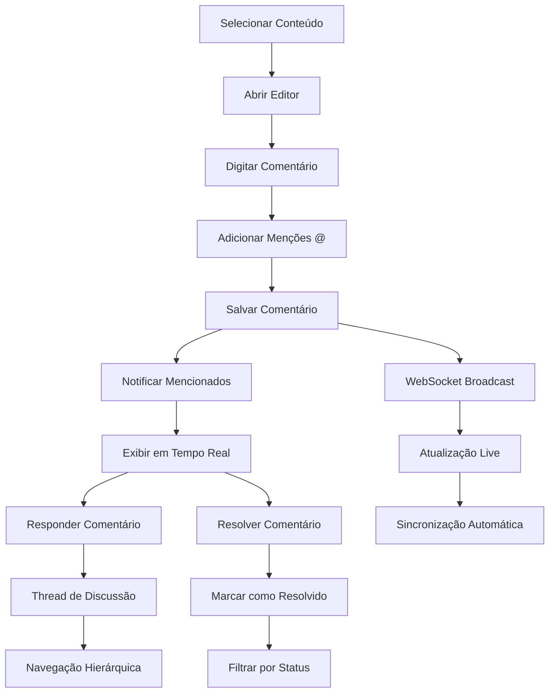

# Sistema de Comentários - Product Requirements Document (PRD)

## 1. Product Overview

O **Sistema de Comentários** é uma funcionalidade de colaboração em tempo real que permite aos usuários adicionar, gerenciar e responder comentários inline em conteúdo (Respostas, Textos Únicos e Quadros) com suporte a menções, threads de discussão e workflow de resolução.

- Facilita a colaboração em tempo real através de comentários contextuais e discussões estruturadas
- Permite feedback específico e direcionado em seções exatas do conteúdo através de ancoragem
- Melhora a comunicação da equipe com menções, notificações e threads de discussão organizadas

## 2. Core Features

### 2.1 User Roles

| Role | Registration Method | Core Permissions |
|------|---------------------|------------------|
| Membro GT | Membro do GT | Pode criar, visualizar e responder comentários no seu GT |
| Articulador | Membro do GT com perfil Articulador+ | Pode resolver comentários, moderar discussões, mencionar usuários |
| Admin Cliente | Usuário administrador | Pode gerenciar todos os comentários, resolver threads, moderar conteúdo |

### 2.2 Feature Module

Nosso sistema de comentários consiste nas seguintes funcionalidades principais:

1. **Comentários Inline**: comentários ancorados, seleção de texto, posicionamento contextual
2. **Threads de Discussão**: respostas aninhadas, organização hierárquica, navegação por threads
3. **Sistema de Menções**: autocomplete de usuários, notificações, integração com @username
4. **Workflow de Resolução**: marcar como resolvido, histórico de resoluções, filtros por status
5. **Editor Rico**: formatação de texto, links, emojis, preview em tempo real
6. **Colaboração em Tempo Real**: atualizações live, sincronização automática, indicadores de presença

### 2.3 Page Details

| Page Name | Module Name | Feature description |
|-----------|-------------|---------------------|
| TaskDetailPage | Painel de Comentários | Exibe comentários da resposta selecionada, filtros por status, contador de comentários não resolvidos |
| TaskDetailPage | Comentário Inline | Permite adicionar comentários ancorados ao texto da resposta, seleção de trechos específicos |
| TextoUnicoPage | Sistema de Comentários | Comentários laterais sincronizados com o editor, ancoragem por parágrafo ou seleção |
| QuadroPage | Comentários por Célula | Comentários específicos por célula do quadro, indicadores visuais de células com comentários |
| Todos os Sistemas | Thread de Discussão | Respostas aninhadas, indentação visual, navegação por níveis de resposta |
| Todos os Sistemas | Editor de Comentário | Editor rico com formatação, menções com @, preview, auto-save |
| Todos os Sistemas | Sistema de Menções | Autocomplete de usuários do GT, notificações automáticas, destaque visual de menções |
| Todos os Sistemas | Resolução de Comentários | Botão resolver/reabrir, histórico de resoluções, filtros por status resolvido |
| Todos os Sistemas | Notificações em Tempo Real | Atualizações live de novos comentários, menções, resoluções via WebSocket |
| Todos os Sistemas | Filtros e Busca | Filtrar por status, autor, data, busca por conteúdo, navegação rápida |

## 3. Core Process

### Fluxo de Criação de Comentário:
1. Usuário seleciona texto ou clica em área específica do conteúdo
2. Abre editor de comentário inline ou lateral
3. Digita comentário com formatação e menções (@usuario)
4. Sistema salva automaticamente e ancora ao conteúdo
5. Notifica usuários mencionados em tempo real
6. Comentário aparece para todos os membros do GT

### Fluxo de Thread de Discussão:
1. Usuário clica em "Responder" em comentário existente
2. Editor de resposta abre indentado sob o comentário pai
3. Resposta é salva como parte da thread
4. Sistema mantém hierarquia e navegação por níveis
5. Notificações são enviadas para participantes da thread

### Fluxo de Resolução:
1. Articulador ou Admin clica em "Resolver" no comentário
2. Sistema marca comentário e thread como resolvida
3. Comentário fica visualmente diferenciado (opacidade reduzida)
4. Filtros permitem ocultar/mostrar comentários resolvidos
5. Histórico de resolução é mantido com timestamp e responsável

## 4. User Interface Design

### 4.1 Design Style

- **Cores Primárias**: Azul (#007bff) para comentários ativos, Cinza (#6c757d) para resolvidos
- **Cores Secundárias**: Verde (#28a745) para resolução, Amarelo (#ffc107) para menções
- **Estilo de Comentários**: Cards com bordas sutis, sombras leves, cantos arredondados (4px)
- **Fontes**: Inter 14px para conteúdo, 12px para metadados, 16px para editor
- **Layout**: Sidebar flutuante ou painel lateral, threads com indentação progressiva
- **Ícones**: Feather icons, tamanho 16px, estilo outline para ações

### 4.2 Page Design Overview

| Page Name | Module Name | UI Elements |
|-----------|-------------|-------------|
| TaskDetailPage | Painel de Comentários | Sidebar direita com lista de comentários, header com contador e filtros, scroll independente |
| TaskDetailPage | Comentário Inline | Indicadores visuais no texto (highlights), tooltips com preview, botões de ação flutuantes |
| TextoUnicoPage | Comentários Laterais | Painel lateral sincronizado com scroll do editor, linhas conectoras entre comentário e texto |
| QuadroPage | Comentários por Célula | Badges numerados nas células, modal/popover para visualizar comentários, cores de status |
| Todos os Sistemas | Thread de Discussão | Indentação visual com linhas conectoras, avatares dos autores, timestamps relativos |
| Todos os Sistemas | Editor de Comentário | Toolbar minimalista, autocomplete de menções, preview em tempo real, botões de ação |
| Todos os Sistemas | Sistema de Menções | Dropdown com busca, avatares e nomes, destaque azul para menções no texto |
| Todos os Sistemas | Resolução de Comentários | Toggle switch para resolver, badge de status, opacidade reduzida para resolvidos |

### 4.3 Responsiveness

- **Desktop-first** com adaptação para tablet (768px+) e mobile (320px+)
- **Touch optimization** para seleção de texto e interações em dispositivos móveis
- **Sidebar collapse** em telas pequenas com overlay modal para comentários
- **Thread navigation** simplificada em mobile com navegação por níveis
- **Editor responsivo** que se adapta ao espaço disponível

## 5. Tipos de Comentários e Ancoragem

### 5.1 Tipos de Ancoragem

| Tipo de Conteúdo | Método de Ancoragem | Visualização | Interação |
|------------------|---------------------|--------------|-----------|
| Resposta de Tarefa | Seleção de texto ou parágrafo | Highlight amarelo, ícone lateral | Click para abrir thread |
| Texto Único | Posição por caractere/linha | Linha conectora, numeração | Scroll sincronizado |
| Quadro/Célula | ID da célula específica | Badge numerado na célula | Modal/popover |
| Conteúdo Geral | Coordenadas ou seção | Marcador flutuante | Tooltip com preview |

### 5.2 Estados de Comentário

| Status | Cor | Descrição | Ações Disponíveis |
|--------|-----|-----------|-------------------|
| Ativo | Azul (#007bff) | Comentário em discussão | Responder, Resolver, Editar, Deletar |
| Resolvido | Cinza (#6c757d) | Discussão finalizada | Reabrir, Visualizar histórico |
| Com Menção | Amarelo (#ffc107) | Usuário foi mencionado | Responder, Marcar como lida |
| Rascunho | Cinza claro (#e9ecef) | Comentário sendo editado | Salvar, Cancelar |

## 6. Funcionalidades Avançadas

### 6.1 Sistema de Menções

- **Autocomplete inteligente**: Busca por nome, email ou @username
- **Notificações automáticas**: Email e notificação in-app para mencionados
- **Destaque visual**: Menções aparecem destacadas no texto do comentário
- **Permissões**: Apenas membros do mesmo GT podem ser mencionados

### 6.2 Colaboração em Tempo Real

- **WebSocket integration**: Atualizações instantâneas de novos comentários
- **Indicadores de presença**: Mostrar quem está visualizando/comentando
- **Sincronização automática**: Resolução de conflitos e merge automático
- **Notificações live**: Toast messages para novos comentários e menções

### 6.3 Editor Rico

- **Formatação básica**: Negrito, itálico, links, listas
- **Suporte a emojis**: Picker de emojis integrado
- **Preview em tempo real**: Visualização do comentário formatado
- **Auto-save**: Salvamento automático a cada 3 segundos

## 7. Performance e Otimização

### 7.1 Carregamento Eficiente

- **Lazy loading**: Carregar comentários sob demanda
- **Pagination**: Máximo 50 comentários por página
- **Cache inteligente**: React Query com 30s stale time
- **Debounce**: Busca e filtros com 300ms delay

### 7.2 Real-time Optimization

- **WebSocket pooling**: Conexão compartilhada para múltiplas páginas
- **Event batching**: Agrupar múltiplas atualizações em um único update
- **Selective updates**: Atualizar apenas comentários visíveis
- **Memory management**: Cleanup de listeners ao sair da página

## 8. Security e Permissions

### 8.1 Controle de Acesso

- **Feature flag**: `ff.comments.enabled` controla disponibilidade global
- **GT-based access**: Usuários só veem comentários do seu GT
- **Role-based actions**: Apenas articuladores podem resolver comentários
- **Content ownership**: Autores podem editar/deletar seus próprios comentários

### 8.2 Validações e Sanitização

- **HTML sanitization**: Limpeza de conteúdo malicioso
- **Rate limiting**: Máximo 10 comentários por minuto por usuário
- **Content validation**: Verificação de tamanho e formato
- **Mention validation**: Verificar se usuário mencionado existe no GT

## 9. Analytics e Métricas

### 9.1 Métricas de Engajamento

- **Número de comentários** por conteúdo e período
- **Taxa de resolução** de comentários por GT
- **Tempo médio** para resolução de discussões
- **Usuários mais ativos** em comentários e menções

### 9.2 Performance Metrics

- **Tempo de carregamento** de threads < 1 segundo
- **Latência de real-time** < 200ms para atualizações
- **Taxa de entrega** de notificações > 99%
- **Satisfação do usuário** via feedback integrado

## 10. Integração com Sistemas Existentes

### 10.1 Páginas de Integração

- **TaskDetailPage**: Painel lateral de comentários para respostas
- **TextoUnicoPage**: Comentários sincronizados com editor
- **QuadroPage**: Comentários por célula com indicadores visuais
- **Dashboard**: Resumo de comentários não resolvidos

### 10.2 Notificações

- **In-app notifications**: Toast messages e badge counters
- **Email notifications**: Digest diário de menções e respostas
- **WebSocket events**: Atualizações em tempo real
- **Mobile push**: Para aplicações futuras

## 11. Future Enhancements

### 11.1 Funcionalidades Futuras

- **Comentários privados**: Visíveis apenas para articuladores
- **Anexos em comentários**: Upload de imagens e documentos
- **Reações**: Like, dislike, emojis em comentários
- **Templates de comentário**: Respostas pré-definidas para revisões
- **Integração com calendário**: Agendar follow-ups de comentários

### 11.2 Melhorias de UX

- **Comentários offline**: Sincronização quando voltar online
- **Busca avançada**: Filtros por autor, data, conteúdo, menções
- **Exportação**: PDF com threads de comentários
- **Keyboard shortcuts**: Navegação rápida por comentários
- **Accessibility**: Suporte completo a leitores de tela

## 12. Success Metrics

### 12.1 Objetivos de Adoção

- **80% dos usuários ativos** utilizando comentários mensalmente
- **Redução de 50%** em emails internos sobre feedback de conteúdo
- **Aumento de 30%** na colaboração entre membros do GT
- **Tempo médio de resolução** de feedback < 24 horas

### 12.2 Qualidade da Experiência

- **Net Promoter Score** > 8 para funcionalidade de comentários
- **Taxa de abandono** < 5% durante criação de comentários
- **Tempo de resposta** da interface < 100ms para ações básicas
- **Disponibilidade** > 99.9% para funcionalidades críticas