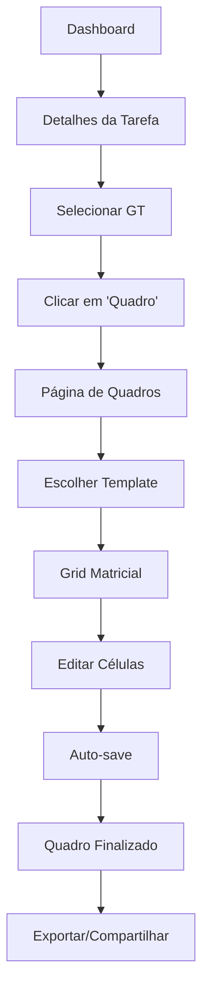

# Sistema de Quadros (Oficinas) - Documento de Requisitos do Produto

## 1. Visão Geral do Produto

O **Sistema de Quadros (Oficinas)** é uma ferramenta colaborativa que permite criar e editar quadros matriciais para facilitar workshops, brainstorming e atividades de grupo. O sistema oferece templates pré-configurados e interface intuitiva para organização visual de informações.

- **Problema a resolver**: Dificuldade em organizar e estruturar informações durante workshops e atividades colaborativas de forma visual e interativa.
- **Usuários-alvo**: Facilitadores de workshops, coordenadores de projetos, membros de grupos de trabalho e articuladores.
- **Valor do produto**: Aumentar a eficiência e qualidade de workshops através de uma interface visual estruturada que facilita a colaboração em tempo real.

## 2. Funcionalidades Principais

### 2.1 Papéis de Usuário

| Papel | Método de Acesso | Permissões Principais |
|-------|------------------|----------------------|
| Membro GT | Acesso via tarefa do GT | Pode visualizar e editar células dos quadros do seu GT |
| Articulador | Acesso via qualquer tarefa | Pode criar, editar e gerenciar quadros de qualquer GT |
| Admin Cliente | Acesso administrativo | Controle total sobre quadros e templates do cliente |

### 2.2 Módulos de Funcionalidade

O sistema de quadros consiste nas seguintes páginas principais:

1. **Página de Quadros**: Interface principal com grid matricial editável, seleção de templates e ferramentas de edição.
2. **Seletor de Templates**: Modal ou painel para escolha de templates pré-configurados (SWOT, Canvas, Brainstorming, etc.).
3. **Visualização de Quadro**: Modo somente leitura para apresentação e revisão de quadros finalizados.

### 2.3 Detalhes das Funcionalidades

| Página | Módulo | Descrição da Funcionalidade |
|--------|--------|----------------------------|
| Página de Quadros | Grid Matricial | Exibir matriz dinâmica de células editáveis com dimensões configuráveis por template. Suportar edição inline com auto-save. |
| Página de Quadros | Editor de Célula | Permitir edição de conteúdo HTML em células individuais com textarea expansível. Salvar automaticamente após 500ms de inatividade. |
| Página de Quadros | Barra de Ferramentas | Mostrar seletor de template, indicador de GT ativo, status de salvamento e opções de visualização. |
| Página de Quadros | Barra de Status | Exibir status de salvamento, última atualização, indicadores de erro e progresso de sincronização. |
| Seletor de Templates | Galeria de Templates | Listar templates disponíveis (SWOT, Canvas, Brainstorming, Decisão, Retrospectiva) com preview e descrição. |
| Seletor de Templates | Preview de Template | Mostrar estrutura visual do template selecionado antes da aplicação. |
| Visualização de Quadro | Modo Somente Leitura | Exibir quadro finalizado sem opções de edição para apresentação e revisão. |
| Visualização de Quadro | Exportação | Permitir exportar quadro como PDF ou imagem para compartilhamento externo. |

## 3. Fluxo Principal de Uso

### Fluxo do Facilitador de Workshop:

1. **Acesso**: Facilitador acessa tarefa específica no dashboard
2. **Seleção de GT**: Escolhe o Grupo de Trabalho para o workshop
3. **Criação de Quadro**: Clica em "Quadro" na página de detalhes da tarefa
4. **Escolha de Template**: Seleciona template apropriado (ex: SWOT para análise estratégica)
5. **Configuração**: Sistema cria grid matricial baseado no template escolhido
6. **Facilitação**: Durante workshop, facilita preenchimento colaborativo das células
7. **Auto-save**: Sistema salva automaticamente todas as alterações
8. **Finalização**: Quadro fica disponível para consulta e exportação

### Fluxo do Participante:

1. **Acesso**: Participante acessa quadro através de link compartilhado ou tarefa
2. **Visualização**: Vê estrutura do quadro e células já preenchidas
3. **Contribuição**: Clica em célula vazia ou existente para editar
4. **Edição**: Digita conteúdo na célula com editor de texto
5. **Salvamento**: Conteúdo é salvo automaticamente ao sair da célula
6. **Colaboração**: Vê atualizações de outros participantes em tempo real

## 4. Design da Interface

### 4.1 Estilo de Design

**Cores Principais:**
- Primária: #007bff (azul para elementos interativos)
- Secundária: #6c757d (cinza para elementos de apoio)
- Sucesso: #28a745 (verde para confirmações)
- Alerta: #ffc107 (amarelo para avisos)
- Erro: #dc3545 (vermelho para erros)

**Estilo dos Componentes:**
- Botões: Arredondados com bordas suaves (border-radius: 6px)
- Grid: Bordas sólidas com hover effects sutis
- Células: Transições suaves para estados de edição
- Modais: Sombras suaves com backdrop translúcido

**Tipografia:**
- Fonte principal: Inter, system-ui, sans-serif
- Tamanhos: 14px (corpo), 16px (títulos), 12px (metadados)
- Peso: 400 (normal), 600 (semi-bold), 700 (bold)

**Layout:**
- Estilo: Interface limpa com foco no conteúdo
- Navegação: Breadcrumbs e botões de ação no topo
- Responsividade: Grid adaptável para mobile e desktop

**Ícones e Elementos Visuais:**
- Ícones: Font Awesome para consistência
- Indicadores: Spinners para loading, badges para status
- Animações: Transições suaves de 200ms

### 4.2 Design das Páginas

| Página | Módulo | Elementos de UI |
|--------|--------|-----------------|
| Página de Quadros | Cabeçalho | Título da tarefa, breadcrumb de navegação, seletor de GT, indicador de template ativo |
| Página de Quadros | Barra de Ferramentas | Dropdown de templates com ícones, botão de modo visualização, indicador de salvamento com spinner |
| Página de Quadros | Grid Principal | Matriz de células com bordas definidas, cabeçalhos de linha/coluna destacados, hover effects nas células editáveis |
| Página de Quadros | Células | Área clicável com placeholder sutil, editor inline com textarea auto-expansível, indicador visual de foco |
| Página de Quadros | Barra de Status | Timestamp da última atualização, status de conectividade, contador de participantes ativos |
| Seletor de Templates | Modal | Overlay escuro, painel centralizado, grid de cards de templates com preview |
| Seletor de Templates | Cards de Template | Imagem de preview, título e descrição, botão "Usar Template", indicador de dimensões |
| Visualização | Modo Apresentação | Grid somente leitura, botões de exportação, controles de zoom, barra de navegação simplificada |

### 4.3 Responsividade

**Desktop-first** com adaptação para mobile:
- **Desktop (>1200px)**: Grid completo com todas as funcionalidades
- **Tablet (768px-1199px)**: Grid compacto com scroll horizontal se necessário
- **Mobile (<768px)**: Grid empilhado ou scroll horizontal, ferramentas colapsadas em menu

**Otimizações para Touch:**
- Células com área mínima de 44px para toque
- Gestos de pinch-to-zoom para navegação
- Teclado virtual otimizado para edição de texto
- Botões de ação ampliados para facilitar interação

## 5. Critérios de Aceitação

### 5.1 Funcionalidades Obrigatórias

**Grid Matricial:**
- ✅ Deve exibir matriz configurável baseada em template
- ✅ Deve permitir edição inline de células individuais
- ✅ Deve salvar automaticamente após 500ms de inatividade
- ✅ Deve mostrar indicadores visuais de estado de edição

**Templates:**
- ✅ Deve incluir pelo menos 5 templates pré-configurados
- ✅ Deve permitir seleção e aplicação de templates
- ✅ Deve preservar conteúdo existente ao trocar templates compatíveis

**Colaboração:**
- ✅ Deve sincronizar mudanças entre usuários em tempo real
- ✅ Deve mostrar indicadores de outros usuários editando
- ✅ Deve resolver conflitos de edição simultânea

**Performance:**
- ✅ Deve carregar quadro em menos de 2 segundos
- ✅ Deve responder a edições em menos de 100ms
- ✅ Deve funcionar com quadros de até 10x10 células

### 5.2 Funcionalidades Desejáveis

**Exportação:**
- 📋 Exportar quadro como PDF formatado
- 📋 Exportar como imagem PNG/JPG
- 📋 Copiar conteúdo para clipboard

**Histórico:**
- 📋 Rastrear versões de células
- 📋 Permitir reversão de mudanças
- 📋 Mostrar histórico de edições

**Personalização:**
- 📋 Criar templates customizados
- 📋 Configurar cores e estilos
- 📋 Definir células fixas e editáveis

## 6. Métricas de Sucesso

### 6.1 Métricas de Adoção
- **Taxa de uso**: 70% dos workshops utilizando quadros digitais
- **Frequência**: Média de 3 quadros criados por GT por mês
- **Retenção**: 80% dos usuários retornando para usar quadros

### 6.2 Métricas de Eficiência
- **Tempo de setup**: Redução de 50% no tempo de preparação de workshops
- **Participação**: Aumento de 30% na participação ativa em workshops
- **Qualidade**: 90% de satisfação dos facilitadores com a ferramenta

### 6.3 Métricas Técnicas
- **Performance**: Tempo de carregamento < 2 segundos
- **Disponibilidade**: 99.5% de uptime
- **Sincronização**: < 1 segundo para propagar mudanças
- **Compatibilidade**: Funcionar em 95% dos navegadores modernos

O Sistema de Quadros transformará a experiência de workshops colaborativos, oferecendo uma ferramenta digital poderosa que combina a flexibilidade de quadros físicos com as vantagens da colaboração online em tempo real.