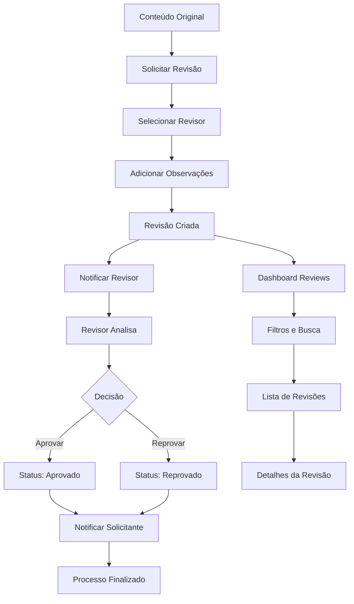

# Sistema de Reviews - Product Requirements Document (PRD)

## 1. Product Overview

O **Sistema de Reviews** é uma funcionalidade de avaliação e feedback que permite aos usuários solicitar, gerenciar e executar revisões estruturadas de conteúdo (Respostas, Textos Únicos e Quadros) com fluxo de aprovação controlado.

- Facilita a colaboração e qualidade do conteúdo através de um processo de revisão formal
- Permite que articuladores solicitem feedback especializado antes da finalização de entregas
- Garante controle de qualidade e alinhamento com padrões organizacionais

## 2. Core Features

### 2.1 User Roles

| Role | Registration Method | Core Permissions |
|------|---------------------|------------------|
| Solicitante | Membro do GT com perfil Articulador+ | Pode solicitar revisões, editar rascunhos, visualizar status |
| Revisor | Usuário designado pelo solicitante | Pode aprovar/reprovar, adicionar pareceres, visualizar conteúdo |
| Visualizador | Membro do GT | Pode visualizar revisões relacionadas ao seu GT |

### 2.2 Feature Module

Nosso sistema de reviews consiste nas seguintes páginas principais:

1. **Página de Reviews**: dashboard central, lista de revisões, filtros e estatísticas
2. **Detalhes da Revisão**: visualização completa, histórico, ações de workflow
3. **Formulário de Solicitação**: criação de nova revisão, seleção de revisor, observações
4. **Interface de Revisão**: parecer detalhado, aprovação/reprovação, comentários

### 2.3 Page Details

| Page Name | Module Name | Feature description |
|-----------|-------------|---------------------|
| Página de Reviews | Dashboard Principal | Exibe estatísticas gerais, contadores por status, navegação por abas (Todas, Pendentes, Minhas Solicitações, Para Revisar) |
| Página de Reviews | Lista de Revisões | Lista paginada com filtros por status, tipo de conteúdo, revisor. Cards com informações resumidas e ações rápidas |
| Página de Reviews | Filtros Avançados | Filtros por status (rascunho, em revisão, aprovado, reprovado), tipo de alvo (resposta, texto único, quadro), revisor, solicitante |
| Detalhes da Revisão | Visualização Completa | Exibe todos os dados da revisão, conteúdo original, parecer do revisor, histórico de mudanças |
| Detalhes da Revisão | Ações de Workflow | Botões contextuais para aprovar, reprovar, editar, cancelar baseados no perfil do usuário e status |
| Formulário de Solicitação | Criação de Revisão | Seleção do tipo de conteúdo, ID do alvo, revisor responsável, observações iniciais |
| Formulário de Solicitação | Seletor de Revisor | Lista de usuários elegíveis para revisão com busca e filtros por competência |
| Interface de Revisão | Editor de Parecer | Editor rich text para parecer detalhado, suporte a formatação, links, imagens |
| Interface de Revisão | Controles de Aprovação | Botões de aprovar/reprovar com confirmação, campos obrigatórios para justificativa |
| Integração com Sistemas | Botões de Revisão | Botões "Solicitar Revisão" integrados em TaskDetailPage, TextoUnicoPage, QuadroPage |
| Integração com Sistemas | Status Indicators | Badges visuais mostrando status de revisão nos conteúdos originais |

## 3. Core Process

### Fluxo do Solicitante:
1. Usuário acessa conteúdo (Resposta, Texto Único ou Quadro)
2. Clica em "Solicitar Revisão" 
3. Seleciona revisor e adiciona observações
4. Sistema cria revisão com status "em_revisao"
5. Revisor recebe notificação
6. Solicitante acompanha progresso na página de Reviews

### Fluxo do Revisor:
1. Revisor recebe notificação de nova revisão
2. Acessa página de Reviews ou link direto
3. Visualiza conteúdo e observações do solicitante
4. Adiciona parecer detalhado no editor
5. Aprova ou reprova a revisão
6. Sistema notifica solicitante do resultado

### Fluxo de Visualização:
1. Membros do GT podem visualizar revisões relacionadas
2. Filtram por status, tipo ou período
3. Acompanham estatísticas e progresso geral

## 4. User Interface Design

### 4.1 Design Style

- **Cores Primárias**: Azul (#007bff) para ações principais, Verde (#28a745) para aprovações
- **Cores Secundárias**: Amarelo (#ffc107) para pendências, Vermelho (#dc3545) para reprovações
- **Estilo de Botões**: Arredondados (border-radius: 6px) com estados hover e disabled
- **Fontes**: Inter ou system fonts, tamanhos 14px (corpo), 16px (títulos), 12px (metadados)
- **Layout**: Card-based com espaçamento consistente, navegação por abas
- **Ícones**: Feather icons ou similar, estilo outline, tamanho 16px-20px

### 4.2 Page Design Overview

| Page Name | Module Name | UI Elements |
|-----------|-------------|-------------|
| Página de Reviews | Dashboard Principal | Cards de estatísticas com ícones coloridos, layout em grid 4 colunas, números grandes e labels descritivos |
| Página de Reviews | Lista de Revisões | Cards brancos com sombra sutil, header com título e badge de status, meta informações em cinza, ações no rodapé |
| Página de Reviews | Filtros | Dropdowns estilizados, botão de limpar filtros, contador de resultados, layout horizontal responsivo |
| Detalhes da Revisão | Visualização | Layout em 2 colunas (conteúdo + sidebar), breadcrumb navigation, timeline de histórico vertical |
| Detalhes da Revisão | Ações de Workflow | Botões contextuais com cores semânticas, confirmação via modal, loading states |
| Formulário de Solicitação | Modal/Drawer | Overlay escuro, container centralizado, campos com labels flutuantes, validação em tempo real |
| Interface de Revisão | Editor de Parecer | Toolbar rica com formatação, preview side-by-side, auto-save indicator, character counter |
| Integração com Sistemas | Botões de Revisão | Botões secundários com ícone, posicionamento consistente, tooltip explicativo |

### 4.3 Responsiveness

- **Desktop-first** com adaptação para tablet (768px+) e mobile (320px+)
- **Touch optimization** para botões e controles em dispositivos móveis
- **Navigation collapse** em telas pequenas com menu hamburger
- **Card stacking** vertical em mobile, grid horizontal em desktop
- **Modal responsivo** que se adapta ao tamanho da tela

## 5. Status e Workflow

### 5.1 Status de Revisão

| Status | Cor | Descrição | Ações Disponíveis |
|--------|-----|-----------|-------------------|
| rascunho | Cinza (#6c757d) | Revisão criada mas não enviada | Editar, Enviar, Cancelar |
| em_revisao | Amarelo (#ffc107) | Aguardando análise do revisor | Visualizar (revisor pode aprovar/reprovar) |
| aprovado | Verde (#28a745) | Conteúdo aprovado pelo revisor | Visualizar histórico |
| reprovado | Vermelho (#dc3545) | Conteúdo reprovado com parecer | Visualizar parecer, Solicitar nova revisão |

### 5.2 Tipos de Conteúdo

| Tipo | Label | Integração | Identificação |
|------|-------|------------|---------------|
| resposta | Resposta de Tarefa | TaskDetailPage | tarefa_id + gt_id |
| texto_unico | Texto Único | TextoUnicoPage | texto_unico_id |
| quadro | Quadro/Oficina | QuadroPage | quadro_id |

## 6. Notifications e Feedback

### 6.1 Notificações do Sistema

- **Nova revisão solicitada**: Notifica revisor designado
- **Revisão aprovada/reprovada**: Notifica solicitante
- **Revisor alterado**: Notifica novo e antigo revisor
- **Revisão cancelada**: Notifica revisor se aplicável

### 6.2 Feedback Visual

- **Toast messages** para ações de sucesso/erro
- **Loading states** em botões e listas
- **Empty states** com ilustrações e call-to-action
- **Error boundaries** para recuperação de erros
- **Skeleton loading** para carregamento de conteúdo

## 7. Performance e Otimização

### 7.1 Carregamento

- **Lazy loading** de componentes não críticos
- **Pagination** para listas grandes (20 itens por página)
- **Debounce** em filtros de busca (300ms)
- **Cache inteligente** via React Query (30s stale time)

### 7.2 Interatividade

- **Optimistic updates** para ações rápidas
- **Auto-save** em formulários longos (5s interval)
- **Keyboard shortcuts** para ações comuns
- **Focus management** para acessibilidade

## 8. Security e Permissions

### 8.1 Controle de Acesso

- **Feature flag**: `ff.reviews.enabled` controla disponibilidade
- **Role-based**: Apenas articuladores podem solicitar revisões
- **Ownership**: Apenas solicitante pode editar rascunhos
- **Review rights**: Apenas revisor designado pode aprovar/reprovar

### 8.2 Validações

- **Client-side**: Validação de formulários em tempo real
- **Server-side**: Validação de permissões e integridade
- **CSRF protection**: Tokens em formulários
- **Rate limiting**: Prevenção de spam de solicitações

## 9. Analytics e Métricas

### 9.1 Métricas de Uso

- **Número de revisões** por período
- **Tempo médio** de aprovação
- **Taxa de aprovação** por revisor
- **Tipos de conteúdo** mais revisados

### 9.2 Performance Metrics

- **Page load time** < 2 segundos
- **Time to interactive** < 3 segundos
- **Error rate** < 1%
- **User satisfaction** via feedback forms

## 10. Future Enhancements

### 10.1 Funcionalidades Futuras

- **Revisão colaborativa** com múltiplos revisores
- **Templates de parecer** para diferentes tipos de conteúdo
- **Integração com calendário** para agendamento de revisões
- **Relatórios avançados** com dashboards executivos
- **API pública** para integrações externas

### 10.2 Melhorias de UX

- **Comentários inline** no conteúdo original
- **Sugestões automáticas** de revisores baseado em histórico
- **Notificações push** via service workers
- **Modo offline** para visualização de revisões
- **Exportação** de relatórios em PDF/Excel